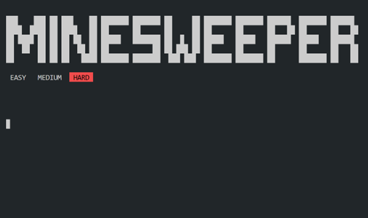
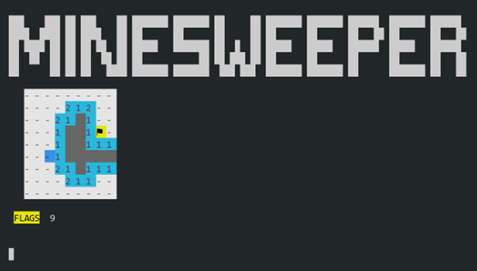
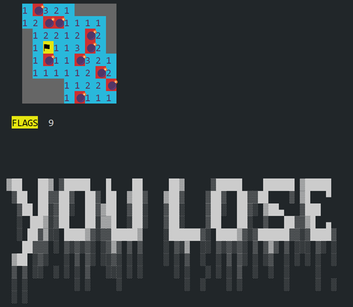

# Minesweeper

Minesweeper game written entirely in C!

## About

Sem-3 CS252 collaborative mini-project written by [Bar0n624](https://github.com/Bar0n624), [vibhav950](https://github.com/vibhav950), and [Vedx0609](https://github.com/Vedx0609).

## Features

It features the following:

- Lightweight and portable design
- Compatible with both Windows and Unix systems
- Leaderboard
- Simple and easy gameplay through a CLI

## Controls

- Use `w`, `a`, `s`, `d` to move the highlighted cell.
- `SPACE` to select the highlighted cell.
- `q` to quit
- `c` to click a cell.
- `f` to place a flag.

## Command line UI

